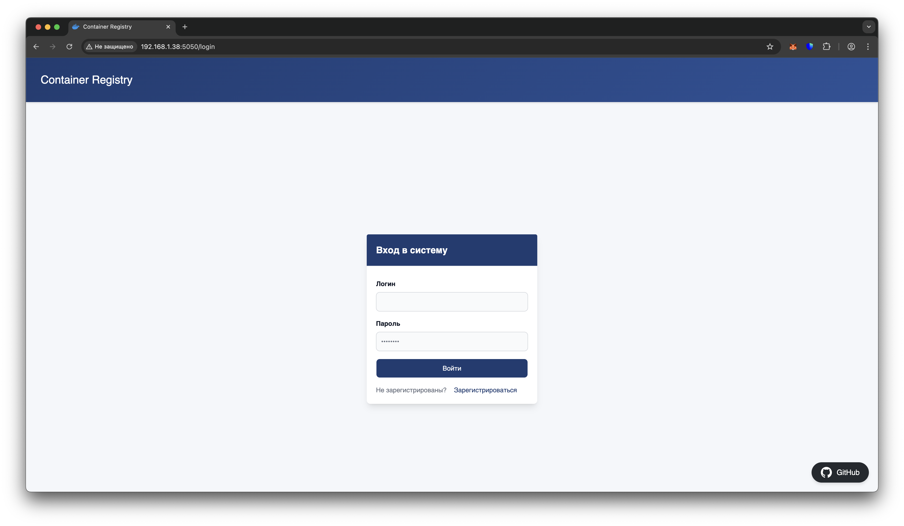
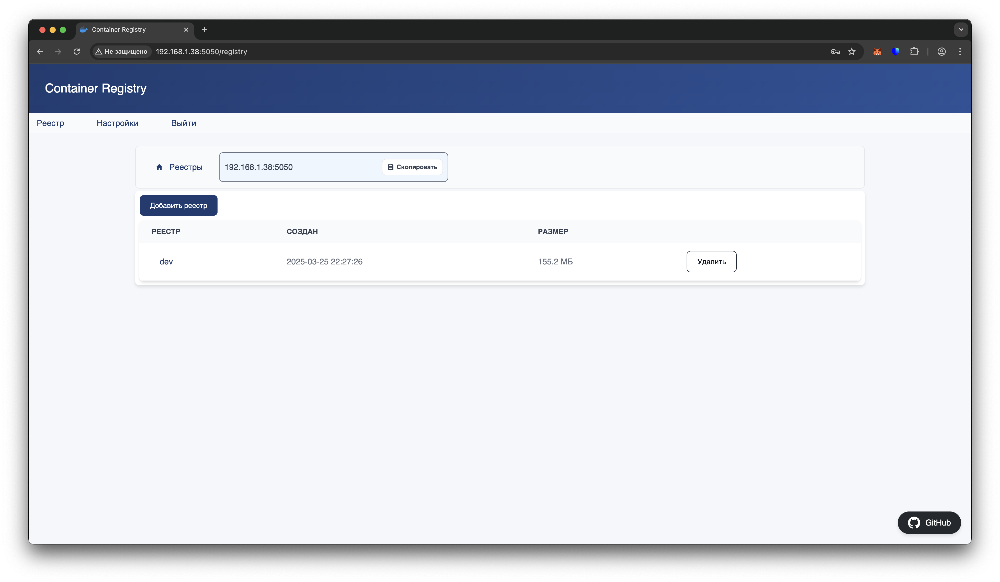
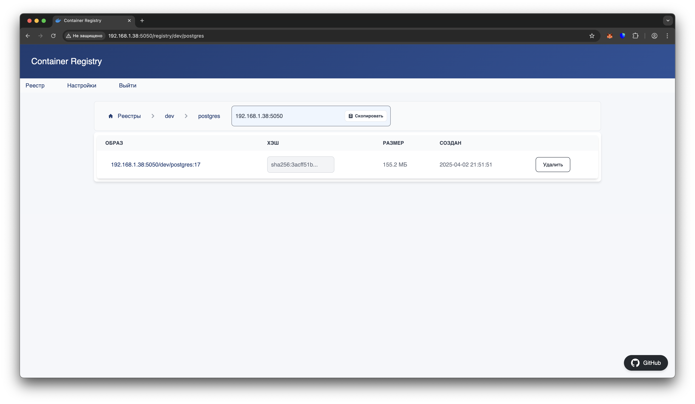

# Container Registry

___

Проект представляет собой реализацию контейнерного реестра, построенного на основе официальной спецификации Docker Registry, которая описана в документации [distribution](https://github.com/distribution/distribution). Основная цель данного проекта — предоставить функциональность для хранения и управления контейнерными образами с поддержкой стандартных операций, таких как загрузка, выгрузка, и поиск образов, аналогично Docker Hub, но с возможностью локальной настройки и развертывания.

## Особенности

- **Совместимость с Docker Registry API**: Полная поддержка [Docker Registry HTTP API v2](https://distribution.github.io/distribution/spec/api/), что позволяет использовать реестр с различными инструментами, поддерживающими стандарт Docker.
- **Безопасность**: Реализованы основные механизмы аутентификации и авторизации для безопасного доступа к реестру.
- **Масштабируемость**: Реализована возможность создавать несколько логических реестров для каждого проекта\стека.
- **Гибкость**: Реализована подключение различных видов хранилищ (локальное или S3).

## Стек технологий

- Реализация основывается на Docker Distribution, что гарантирует совместимость с существующими инструментами экосистемы Docker.
- Использован Go для реализации серверной логики.
- Использован Solid.js для реализации клиентского UI.

## Установка

### Docker

```bash
docker volume create registry-data
docker run -d --restart unless-stopped -p 5050:5050 \
-v ./conf:/registry/conf.d:ro \
-v registry-data:/registry/var \
--name registry rosomilanov/container-registry
```

### Docker compose

```bash
services:
  registry:
    image: rosomilanov/container-registry:latest
    container_name: registry
    restart: unless-stopped
    ports:
      - 5050:5050
    volumes:
      - ./conf:/registry/conf.d:ro
      - registry-data:/registry/var

volumes:
  registry-data:
```

Сервис будет доступен по адресу http://192.168.1.38:5050/login



## Конфигурация

- Конфигурация приложения осуществляется в декларативном стиле с помощью файла конфигурации `config.yaml`
- Пример конфигурации для локального хранилища:
```bash config.yaml
server:
  realm: http://192.168.1.38:5050
  service: 192.168.1.38:5050
  issuer: local-registry
  jwt: qwerty

storage:
  type: local

```
- Пример конфигурации для S3 хранилища:
```bash config.yaml
server:
  realm: http://192.168.1.38:5050
  service: 192.168.1.38:5050
  issuer: local-registry
  jwt: qwerty

storage:
  type: s3
  credentials:
    endpoint: https://storage.network.net
    access_key: your_access_key
    secret_key: your_secret_key
    ssl: true
```
- папку с файлом `config.yaml` необходимо смонтировать в контейнер по пути `/registry/conf.d`

## Использование

- создать реестр через веб-интерфейс:



- авторизоваться в container registry:

```bash
docker login -u test -p test 192.168.1.38:5050
```

- собрать образ по правилу <адрес docker registry>/<название реестра>:<тег> - 192.168.1.38:5050/dev/alpine

- загрузить образ:

```bash
docker push 192.168.1.38:5050/dev/postgres:17
```

- скачать образ:

```bash
docker pull 192.168.1.38:5050/dev/postgres:17
```


