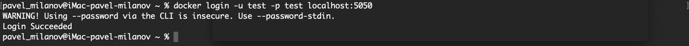
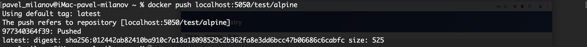

# Container Registry

___

Проект представляет собой реализацию контейнерного реестра, построенного на основе официальной спецификации Docker Registry, которая описана в документации [distribution](https://github.com/distribution/distribution). Основная цель данного проекта — предоставить функциональность для хранения и управления контейнерными образами с поддержкой стандартных операций, таких как загрузка, выгрузка, и поиск образов, аналогично Docker Hub, но с возможностью локальной настройки и развертывания.

## Особенности

- **Совместимость с Docker Registry API**: Полная поддержка [Docker Registry HTTP API v2](https://distribution.github.io/distribution/spec/api/), что позволяет использовать реестр с различными инструментами, поддерживающими стандарт Docker.
- **Безопасность**: Реализованы основные механизмы аутентификации и авторизации для безопасного доступа к реестру.
- **Масштабируемость**: Реализована возможность создавать несколько логических реестров для каждого проекта\стека.

## Стек технологий

- Реализация основывается на Docker Distribution, что гарантирует совместимость с существующими инструментами экосистемы Docker.
- Использован Go для реализации серверной логики.
- Использован Solid.js для реализации клиентского UI.

## Установка

### Docker

```bash
docker run -d --restart unless-stopped -p 5050:5050 \
-v ./registry/db:/registry/var:rw -v ./registry/store:/registry/data:rw \
-e URL=http://localhost:5050 -e JWT_SECRET=qwerty  \
--name registry rosomilanov/container-registry 
```

### Docker compose

```bash
services:
  registry:
    image: rosomilanov/container-registry:latest
    container_name: registry
    restart: unless-stopped
    environment:
      - JWT_KEY=qwerty
      - URL=http://localhost:5050
    ports:
      - 5050:5050
    volumes:
      - ./registry/db:/registry/var
      - ./registry/store:/registry/data

```

Сервис будет доступен по адресу http://localhost:5050/login


## Использование

- создать реестр через веб-интерфейс:


- авторизоваться в container registry:

```bash
docker login -u test -p test localhost:5050
```



- собрать образ по правилу <адрес docker registry>/<название реестра>:<тег> - localhost:5050/dev/alpine

- загрузка образа:

```bash
docker push localhost:5050/dev/alpine
```


